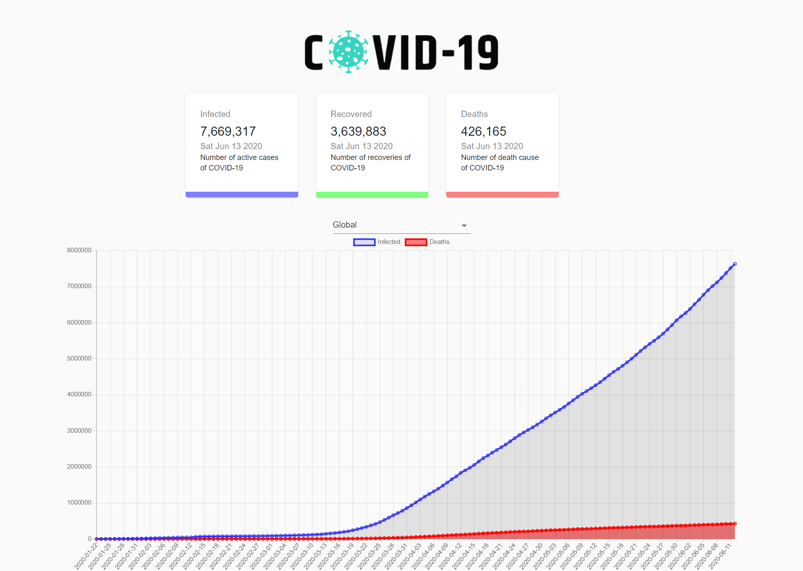

<h1 align="center">
	
</h1>                                                              

<h3 align="center">COVID-19 Dashboard</h3>

<h1 align="center">
	
</h1>  
<h2>Introduction</h2>
<p>Covid-19 Dashboard website gives you information about countries or cities data like How many "people Infected and recover and death causes" due to COVID-19 virus in the form of charts.</p>

<h2>Technologies</h2>
<ul>
<li>Reactjs</li>
<li>Material UI</li>
<li>React Counter</li>
<li>React Chartjs</li>
</ul>

<h2>How to Launch</h2>

To clone and run this application, From your command line:

```bash
# Clone this repository
$ git clone https://github.com/ganesh1172/covid-19-dashboard.git

#install package
$ npm install

#run program using
$ npm start
```

## Support

Show some :heart: and star the repo to support the project. Demo version:- 

